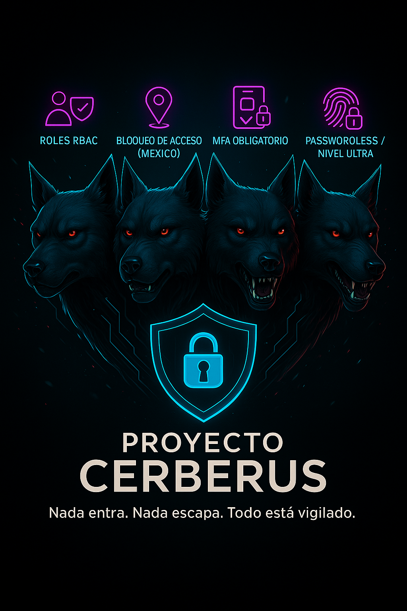

# 🛡️ Proyecto Cerberus  
Nada entra. Nada escapa. Todo está vigilado.  

Proyecto de prácticas de seguridad en Microsoft Entra ID (Azure AD) enfocado en el uso de Acceso Condicional, roles administrativos, MFA avanzado y Zero Trust.  

---

## 🎥 Vídeo explicativo  
https://github.com/Geovana78/Proyecto-Cerberus/blob/main/imagenes/video-cerberus.mp4  

---

## 🖼️ Banner / Imagen Principal  
  

---

## 📌 Objetivos del Proyecto  
- Implementar un sistema de seguridad multinivel inspirado en la metáfora de Cerberus con 4 cabezas.  
- Aplicar parámetros reales de Acceso Condicional, MFA avanzado y roles administrativos.  
- Documentar un flujo de seguridad corporativa como ejemplo práctico de IAM (Identity & Access Management).  

⚠️ **Importante**: Este proyecto es un laboratorio educativo para practicar conceptos de seguridad.  
No debe aplicarse directamente en entornos de producción sin las debidas validaciones.  

---

## 🔑 Configuración en 4 Cabezas  

🟥 **Cabeza 1 – Usuarios y Roles**  
- Asignación de roles diferenciados en la cuenta de facturación:  
  - Propietario: control total.  
  - Colaborador: administración parcial.  
  - Lector: acceso de lectura en solitario.  
- Separación clara de privilegios para prevenir riesgos de escalada.  

⚠️ **Advertencia**: Nunca te asignes restricciones que puedan bloquear tu propia cuenta de administrador.  
Siempre prueba las políticas con un usuario de prueba antes de aplicarlas a toda la organización.  

---

🟨 **Cabeza 2 – Bloqueo por Ubicación**  
- Directiva para restringir accesos fuera de México.  
- Configuración de ubicación con nombre (México) como zona confiable.  
- Usuarios fuera de esta ubicación no pueden autenticarse.  

💡 **Consejo**: Define al menos dos ubicaciones seguras (ejemplo: oficina y ciudad principal).  
Así evitas perder acceso si tu IP cambia inesperadamente.  

---

🟩 **Cabeza 3 – MFA Obligatorio**  
- Aplicación de autenticación multifactor (MFA) como requisito para acceder a recursos.  
- Implementación de:  
  - Autenticador de Microsoft.  
  - Códigos de verificación temporales.  

⚠️ **Importante**: El MFA no es opcional, reduce más del 90% de los ataques de robo de credenciales.  

📌 **Nota**: En este laboratorio se utilizó Microsoft Authenticator,  
pero puedes combinarlo con otros factores de autenticación compatibles.  

---

🟦 **Cabeza 4 – Niveles de Autenticación**  
- Creación del nivel **Cerberus Nivel Ultra**:  
  - MFA sin contraseña (Windows Hello, FIDO2, Authenticator sin contraseña).  
  - MFA resistente al phishing (credenciales seguras).  
- Aplicado a usuarios críticos para máxima protección.  

💡 **Consejo**: Aplica este nivel solo a cuentas críticas (administradores, finanzas, seguridad).  
Esto equilibra la protección sin afectar la experiencia de todos los usuarios.  

---

## 📊 Resultados  
- Seguridad escalada en capas.  
- Control granular por rol, ubicación, factor de autenticación e intensidad.  
- Ejemplo práctico de cómo Zero Trust se aplica en entornos reales.  

📌 **Nota**: Este laboratorio fue diseñado como ejemplo educativo.  
Puede ser extendido con más directivas, informes o integraciones de seguridad.  

---

## 🗂️ Estructura del Repositorio  
- `/docs` → Documentación detallada de cada directiva.  
- `/imagenes` → Capturas de referencia, banner y video del proyecto.  
- `README.md` → Resumen ejecutivo del proyecto.  

---

## 🚀 Tecnologías  
- Microsoft Entra ID (Azure AD)  
- Acceso condicional  
- Microsoft Authenticator  
- Passwordless (FIDO2 / Windows Hello)  

---

## 📌 Autor  
**Geovana Martínez Sepúlveda**  
Estudio de caso en Identity & Access Management (IAM) con Microsoft Azure.  

---

## 📜 Licencia  
Este proyecto está bajo la **Licencia MIT**.  
